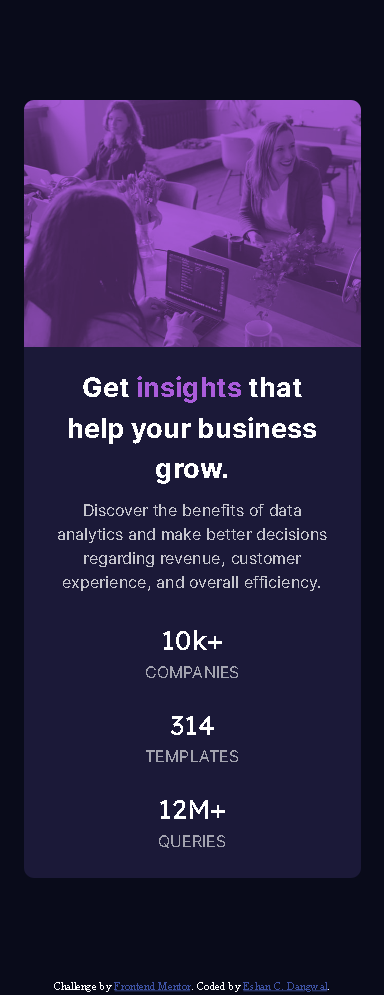
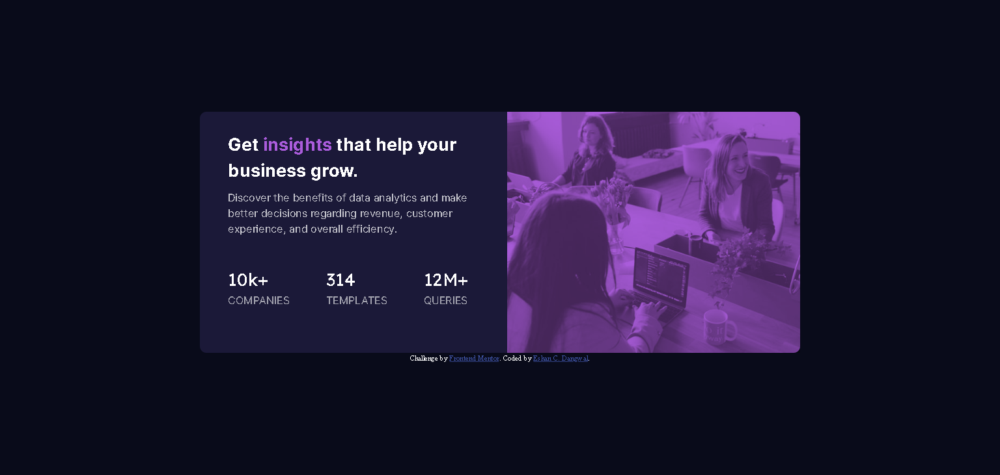

# Frontend Mentor - NFT preview card component solution

This is a solution to the [NFT preview card component challenge on Frontend Mentor](https://www.frontendmentor.io/challenges/nft-preview-card-component-SbdUL_w0U). Frontend Mentor challenges help you improve your coding skills by building realistic projects. 

## Table of contents

- [Frontend Mentor - NFT preview card component solution](#frontend-mentor---nft-preview-card-component-solution)
  - [Table of contents](#table-of-contents)
  - [Overview](#overview)
    - [The challenge](#the-challenge)
    - [Screenshot](#screenshot)
    - [Links](#links)
  - [My process](#my-process)
    - [Built with](#built-with)
    - [What I learned](#what-i-learned)
    - [Useful resources](#useful-resources)
  - [Author](#author)

**Note: Delete this note and update the table of contents based on what sections you keep.**

## Overview

### The challenge

Users should be able to:

- View the optimal layout depending on their device's screen size
- See hover states for interactive elements

### Screenshot

- Mobile design

  

- Desktop design
  

### Links

- Solution URL: [Add solution URL here](https://your-solution-url.com)
- Live Site URL: [Add live site URL here](https://your-live-site-url.com)

## My process

### Built with

- Semantic HTML5 markup
- CSS custom properties
- Flexbox
- CSS Grid
- Mobile-first workflow
- [React](https://reactjs.org/) - JS library
- [Next.js](https://nextjs.org/) - React framework
- [Styled Components](https://styled-components.com/) - For styles

### What I learned

-Github
-Deploying a project through Vercel

### Useful resources

- [Github] (https://github.com/)
- [Vercel] (https://vercel.com/dashboard)
- 
## Author

- ENS - [williamclay.eth](https://etherscan.io/address/0x82A6aF0fCE72997068D134921F1363140f7009e9)
- Frontend Mentor - [@williamclay8](https://www.frontendmentor.io/profile/williamclay8)
- Twitter - [@williamclayhoot](https://www.twitter.com/williamclayhoot)
- Etherscan Project Address - (https://rinkeby.etherscan.io/address/0x82A6aF0fCE72997068D134921F1363140f7009e9#tokentxnsErc1155)
- Github - [williamclay8](https://github.com/williamclay8)

